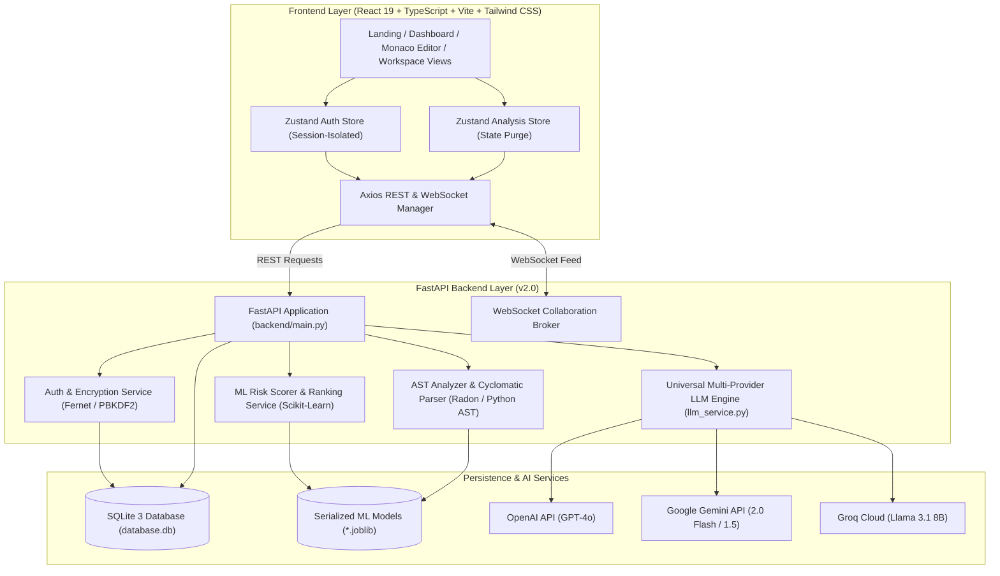
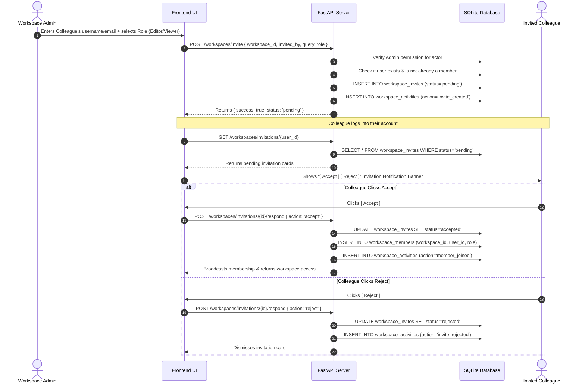
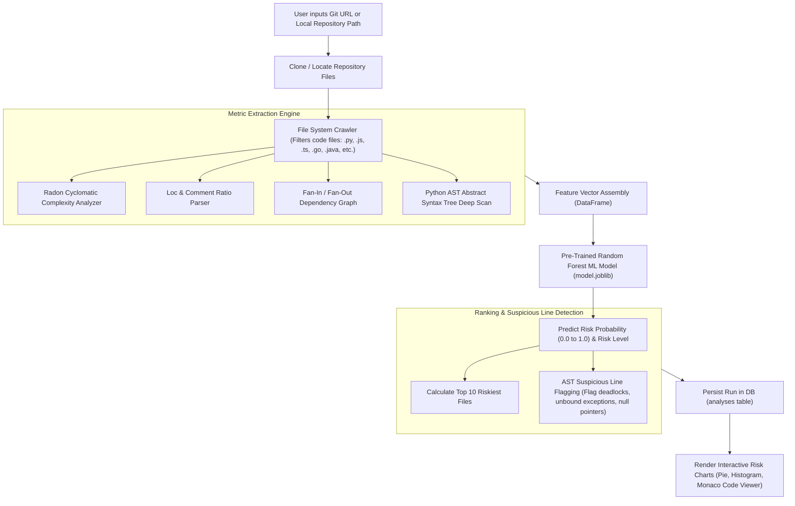
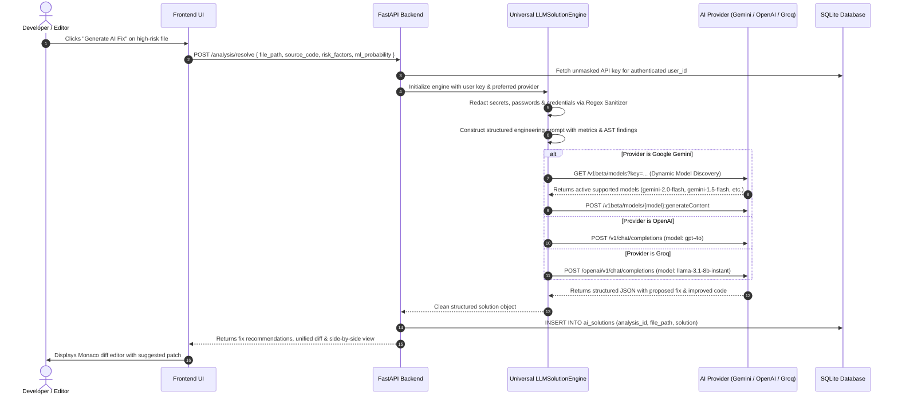
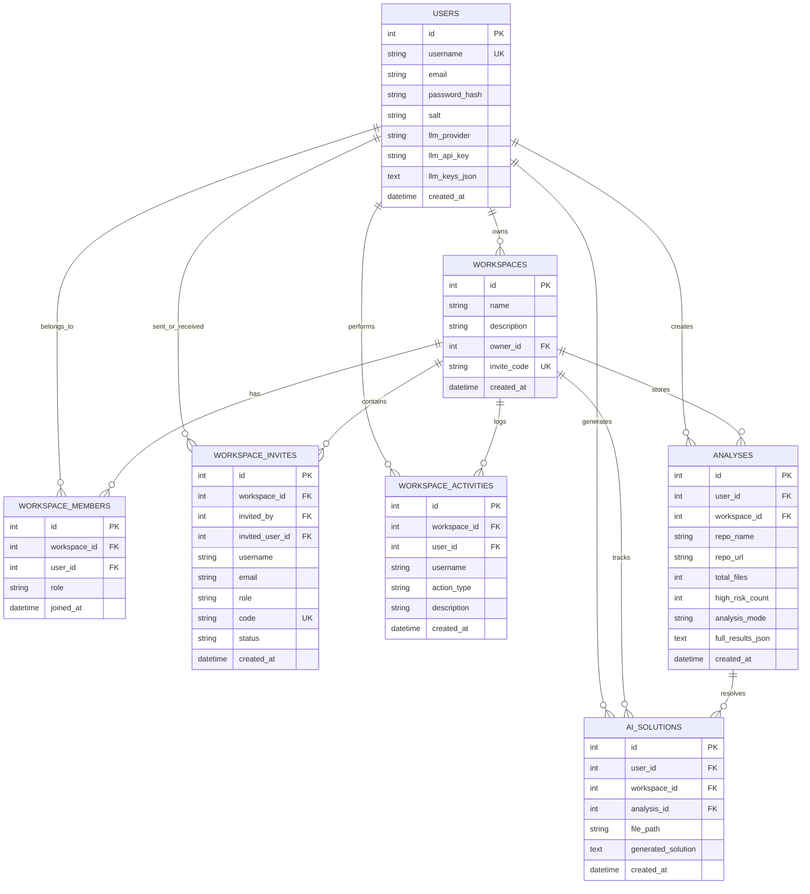

# Enterprise Bug Risk Intelligence & Automated Resolver 2.0
## Comprehensive System Architecture, End-to-End Workflows & Database Design

---

## 📑 Table of Contents

1. [System Overview & Architecture](#1-system-overview--architecture)
2. [End-to-End Application Workflows](#2-end-to-end-application-workflows)
   - [Workflow A: Authentication & Encrypted API Key Session Flow](#workflow-a-authentication--encrypted-api-key-session-flow)
   - [Workflow B: Collaborative Workspaces & Invitation-Approval Workflow](#workflow-b-collaborative-workspaces--invitation-approval-workflow)
   - [Workflow C: Repository Ingestion, ML Risk Scoring & AST Flagging](#workflow-c-repository-ingestion-ml-risk-scoring--ast-flagging)
   - [Workflow D: Multi-Provider LLM Auto-Remediation & Diff Synthesis](#workflow-d-multi-provider-llm-auto-remediation--diff-synthesis)
3. [Database Architecture & Connection Management](#3-database-architecture--connection-management)
   - [Connection Lifecycle & Environment Adapters](#connection-lifecycle--environment-adapters)
   - [Entity-Relationship Diagram (ERD)](#entity-relationship-diagram-erd)
   - [Table Schemas & Column Specifications](#table-schemas--column-specifications)
   - [Automatic Schema Migrations](#automatic-schema-migrations)
4. [API Endpoints & Sequence Flows](#4-api-endpoints--sequence-flows)
5. [Role-Based Access Control (RBAC) Matrix](#5-role-based-access-control-rbac-matrix)
6. [Security, Privacy & Data Isolation Architecture](#6-security-privacy--data-isolation-architecture)

---

## 1. System Overview & Architecture

The **Enterprise Bug Risk Intelligence and Automated Resolver Platform (v2.0)** is an end-to-end full-stack software intelligence platform that combines **deterministic static code analysis**, **machine learning classification models (Random Forest / Ensemble)**, and **multi-provider generative AI engines** (OpenAI GPT-4o, Google Gemini 2.0/1.5, and Groq Llama 3) to discover and fix software defects before they hit production.



---

## 2. End-to-End Application Workflows

### Workflow A: Authentication & Encrypted API Key Session Flow

1. **Registration / Login**:
   - The user inputs credentials via `/login` or `/register`.
   - Passwords are verified against stored hashes (PBKDF2 SHA-256 with random salt).
   - On successful authentication, the backend issues a signed JWT Bearer token containing `sub` (username) and `user_id`.
2. **Clean Session Initialization**:
   - The frontend Zustand `authStore` executes `login(user, initialConfig)`.
   - **Crucial Isolation Step**: All prior state from previous users in memory or localStorage is completely cleared before initializing new session state.
3. **Per-Session API Key Encryption**:
   - Users can configure API keys for OpenAI, Google Gemini, and Groq in **Settings**.
   - Keys are encrypted server-side using **Fernet symmetric encryption** before saving to `users.llm_keys_json`.
   - When transmitted back to the browser for display, keys are strictly masked (`••••••••`). Unmasked keys are only decrypted transiently in memory when executing an LLM fix requested by that authenticated user.

---

### Workflow B: Collaborative Workspaces & Invitation-Approval Workflow



---

### Workflow C: Repository Ingestion, ML Risk Scoring & AST Flagging



---

### Workflow D: Multi-Provider LLM Auto-Remediation & Diff Synthesis



---

## 3. Database Architecture & Connection Management

### Connection Lifecycle & Environment Adapters

Database connections are managed via [`backend/database/db.py`](file:///f:/Github/Software_bug_prediction_and_resolver2.0/backend/database/db.py).
- **Thread Safety & Row Mapping**: Every query obtains a fresh connection via `get_db()`, sets `conn.row_factory = sqlite3.Row` for dictionary-like key access, enables foreign key constraints with `PRAGMA foreign_keys = ON`, executes the command, commits transactions, and properly closes the handle.
- **Serverless / Lambda Compatibility**: On read-only environments (such as AWS Lambda or Vercel serverless functions), `db.py` automatically initializes and clones the database template into `/tmp/app.db`.
- **Automatic Initialization**: On server startup (`backend/main.py`), `init_db()` is invoked, creating all tables and auto-migrating missing columns.

```python
def get_db():
    conn = sqlite3.connect(DB_PATH, check_same_thread=False)
    conn.row_factory = sqlite3.Row
    conn.execute("PRAGMA foreign_keys = ON;")
    return conn
```

---

### Entity-Relationship Diagram (ERD)



---

### Table Schemas & Column Specifications

#### 1. `users` (User Authentication & Encrypted LLM Keys)
| Column | Type | Constraints | Description |
|---|---|---|---|
| `id` | `INTEGER` | `PRIMARY KEY AUTOINCREMENT` | Unique identifier for user |
| `username` | `TEXT` | `UNIQUE NOT NULL` | Login username |
| `email` | `TEXT` | `DEFAULT ''` | Optional user contact email |
| `password_hash`| `TEXT` | `NOT NULL` | PBKDF2 SHA-256 password hash |
| `salt` | `TEXT` | `NOT NULL` | Cryptographic salt |
| `llm_provider` | `TEXT` | `DEFAULT 'openai'` | Active selected LLM provider (`openai`, `gemini`, `groq`) |
| `llm_api_key` | `TEXT` | `DEFAULT ''` | Fernet-encrypted active API key |
| `llm_keys_json`| `TEXT` | `DEFAULT '{}'` | Fernet-encrypted JSON dictionary of all configured keys |
| `created_at` | `TIMESTAMP` | `DEFAULT CURRENT_TIMESTAMP` | Registration timestamp |

#### 2. `workspaces` (Collaborative Tenants)
| Column | Type | Constraints | Description |
|---|---|---|---|
| `id` | `INTEGER` | `PRIMARY KEY AUTOINCREMENT` | Workspace unique identifier |
| `name` | `TEXT` | `NOT NULL` | Display name of the workspace |
| `description` | `TEXT` | `DEFAULT ''` | Workspace purpose / details |
| `owner_id` | `INTEGER` | `NOT NULL, FK(users.id)` | Creator / Principal Admin of the workspace |
| `invite_code` | `TEXT` | `UNIQUE NOT NULL` | Unique shareable alphanumeric code |
| `created_at` | `TIMESTAMP` | `DEFAULT CURRENT_TIMESTAMP` | Creation timestamp |

#### 3. `workspace_members` (RBAC Association)
| Column | Type | Constraints | Description |
|---|---|---|---|
| `id` | `INTEGER` | `PRIMARY KEY AUTOINCREMENT` | Membership record ID |
| `workspace_id`| `INTEGER` | `NOT NULL, FK(workspaces.id) ON DELETE CASCADE` | Associated workspace |
| `user_id` | `INTEGER` | `NOT NULL, FK(users.id) ON DELETE CASCADE` | Associated user |
| `role` | `TEXT` | `NOT NULL DEFAULT 'editor'` | Access role: `'admin'`, `'editor'`, or `'viewer'` |
| `joined_at` | `TIMESTAMP` | `DEFAULT CURRENT_TIMESTAMP` | Join timestamp |
| *Constraint* | `UNIQUE(workspace_id, user_id)` | — | Prevents duplicate memberships |

#### 4. `workspace_invites` (Invitation Approval Workflow)
| Column | Type | Constraints | Description |
|---|---|---|---|
| `id` | `INTEGER` | `PRIMARY KEY AUTOINCREMENT` | Invitation record ID |
| `workspace_id`| `INTEGER` | `NOT NULL, FK(workspaces.id) ON DELETE CASCADE` | Target workspace |
| `invited_by` | `INTEGER` | `NOT NULL, FK(users.id)` | Admin who created the invite |
| `invited_user_id` | `INTEGER` | `DEFAULT NULL` | Specific user ID invited |
| `username` | `TEXT` | `DEFAULT ''` | Registered username of invitee |
| `email` | `TEXT` | `DEFAULT ''` | Invitee email |
| `role` | `TEXT` | `NOT NULL DEFAULT 'editor'` | Proposed role (`admin`, `editor`, `viewer`) |
| `code` | `TEXT` | `UNIQUE NOT NULL` | Unique invite validation code |
| `status` | `TEXT` | `DEFAULT 'pending'` | Workflow status: `'pending'`, `'accepted'`, `'rejected'`, `'cancelled'` |
| `created_at` | `TIMESTAMP` | `DEFAULT CURRENT_TIMESTAMP` | Dispatched timestamp |

#### 5. `workspace_activities` (Audit & Real-Time Collaboration Log)
| Column | Type | Constraints | Description |
|---|---|---|---|
| `id` | `INTEGER` | `PRIMARY KEY AUTOINCREMENT` | Activity log record ID |
| `workspace_id`| `INTEGER` | `NOT NULL, FK(workspaces.id) ON DELETE CASCADE` | Workspace scope |
| `user_id` | `INTEGER` | `NOT NULL, FK(users.id)` | Actor user ID |
| `username` | `TEXT` | `NOT NULL` | Actor display name |
| `action_type` | `TEXT` | `NOT NULL` | Action tag (e.g. `scan_executed`, `ai_fix_generated`, `member_joined`) |
| `description` | `TEXT` | `NOT NULL` | Human-readable audit narrative |
| `created_at` | `TIMESTAMP` | `DEFAULT CURRENT_TIMESTAMP` | Event timestamp |

#### 6. `analyses` (Historical Repository Scans)
| Column | Type | Constraints | Description |
|---|---|---|---|
| `id` | `INTEGER` | `PRIMARY KEY AUTOINCREMENT` | Analysis run record ID |
| `user_id` | `INTEGER` | `NOT NULL, FK(users.id)` | Scan initiator |
| `workspace_id`| `INTEGER` | `DEFAULT NULL, FK(workspaces.id) ON DELETE SET NULL` | Workspace scope (or NULL for Personal) |
| `repo_name` | `TEXT` | `NOT NULL` | Repository name |
| `repo_url` | `TEXT` | `DEFAULT ''` | Repository source URL / local path |
| `total_files` | `INTEGER` | `NOT NULL` | Total source files audited |
| `high_risk_count` | `INTEGER` | `NOT NULL` | Count of files exceeding 75% risk score |
| `analysis_mode` | `TEXT` | `DEFAULT 'Normal Mode (All Files)'` | Scan profile used |
| `full_results_json` | `TEXT` | `NOT NULL` | JSON payload of file rankings and metrics |
| `created_at` | `TIMESTAMP` | `DEFAULT CURRENT_TIMESTAMP` | Scan execution timestamp |

#### 7. `ai_solutions` (AI Fix Solutions & History)
| Column | Type | Constraints | Description |
|---|---|---|---|
| `id` | `INTEGER` | `PRIMARY KEY AUTOINCREMENT` | AI solution record ID |
| `user_id` | `INTEGER` | `NOT NULL, FK(users.id)` | Requesting developer ID |
| `workspace_id`| `INTEGER` | `DEFAULT NULL, FK(workspaces.id) ON DELETE SET NULL` | Workspace scope |
| `analysis_id` | `INTEGER` | `DEFAULT NULL, FK(analyses.id) ON DELETE CASCADE` | Linked analysis scan ID |
| `file_path` | `TEXT` | `NOT NULL` | Target source file path |
| `generated_solution` | `TEXT` | `NOT NULL` | JSON payload with problem summary, fix steps & improved code |
| `created_at` | `TIMESTAMP` | `DEFAULT CURRENT_TIMESTAMP` | Resolution timestamp |

---

### Automatic Schema Migrations

To avoid breaking existing local databases, `init_db()` executes non-destructive `PRAGMA table_info` checks on startup and applies `ALTER TABLE ADD COLUMN` for any newly introduced columns:

```python
# Auto-migrate missing columns for existing users table
cursor.execute("PRAGMA table_info(users)")
u_cols = [r["name"] for r in cursor.fetchall()]
if "llm_keys_json" not in u_cols:
    cursor.execute("ALTER TABLE users ADD COLUMN llm_keys_json TEXT DEFAULT '{}'")

# Auto-migrate workspace_invites columns
cursor.execute("PRAGMA table_info(workspace_invites)")
wi_cols = [r["name"] for r in cursor.fetchall()]
if "invited_user_id" not in wi_cols:
    cursor.execute("ALTER TABLE workspace_invites ADD COLUMN invited_user_id INTEGER DEFAULT NULL")
```

---

## 4. API Endpoints & Sequence Flows

### Authentication & Keys
- `POST /auth/register` — Creates user account with password hashing.
- `POST /auth/login` — Authenticates credentials and returns JWT token + masked config.
- `POST /auth/config` — Saves Fernet-encrypted API keys per session.
- `GET /auth/config/{user_id}` — Retrieves active provider and masked key indicators.

### Workspaces & Invitations
- `POST /workspaces/create` — Creates a new collaborative team workspace.
- `GET /workspaces/user/{user_id}` — Retrieves list of workspaces the user owns or belongs to.
- `GET /workspaces/{id}?user_id={uid}` — Retrieves workspace details, member list & audit logs.
- `POST /workspaces/invite` — Sends a pending invitation to a registered user.
- `GET /workspaces/invitations/{user_id}` — Retrieves incoming pending invitations for a user.
- `POST /workspaces/invitations/{id}/respond` — Accepts or rejects a workspace invitation.
- `GET /workspaces/{id}/invitations?user_id={uid}` — Returns outgoing pending invitations for Admins.
- `DELETE /workspaces/invitations/{id}?user_id={uid}` — Revokes/cancels a pending invitation.
- `POST /workspaces/update-role` — Updates member access level (`admin`, `editor`, `viewer`).
- `POST /workspaces/remove-member` — Removes a member from a workspace.

### Intelligence & AI Remediation
- `POST /analysis/run` — Executes the ML risk scoring engine and AST cyclomatic extraction.
- `POST /analysis/resolve` — Redacts secrets, queries configured LLM, and formats code fixes.
- `POST /analysis/test-connection` — Validates user API key against LLM provider with failover.
- `GET /analysis/history/{user_id}` — Retrieves historical scans filtered by personal or workspace scope.
- `GET /analysis/solutions` — Retrieves past AI fix solutions for a specific file or scan.

---

## 5. Role-Based Access Control (RBAC) Matrix

| Capability / Action | Personal Workspace | Collaborative: Admin | Collaborative: Editor | Collaborative: Viewer |
|---|:---:|:---:|:---:|:---:|
| **Execute Repository Scans** | ✅ | ✅ | ✅ | ❌ *(Read-only)* |
| **Request AI Fixes (LLM Fix)** | ✅ | ✅ | ✅ | ❌ *(Read-only)* |
| **View Audit Logs & Metrics** | ✅ | ✅ | ✅ | ✅ |
| **Inspect Source Code & AST** | ✅ | ✅ | ✅ | ✅ |
| **Invite New Team Members** | ❌ *(Single User)* | ✅ *(Pending status)* | ❌ | ❌ |
| **Change Member Roles** | ❌ | ✅ | ❌ | ❌ |
| **Revoke Pending Invites** | ❌ | ✅ | ❌ | ❌ |
| **Remove Members** | ❌ | ✅ | ❌ | ❌ |
| **Configure Private LLM Keys** | ✅ *(Confidential)* | ✅ *(Confidential)* | ✅ *(Confidential)* | ✅ *(Confidential)* |

---

## 6. Security, Privacy & Data Isolation Architecture

1. **Zero Cross-User State Bleeding**:
   - Authentication storage is purged on logout (`useAnalysisStore.clearAnalysis()` + `localStorage.removeItem('auth-storage-v2')`).
   - Logins never inherit cached keys or workspace state from preceding sessions.
2. **Confidential LLM Keys**:
   - API keys are never stored in plaintext and never shared with team members in a collaborative workspace. Every user uses their own encrypted per-session key.
3. **Secret Redaction Pipeline**:
   - Source code submitted for AI resolution is passed through `redact_secrets()` in [`llm_service.py`](file:///f:/Github/Software_bug_prediction_and_resolver2.0/backend/services/llm_service.py) to strip hardcoded API keys (`sk-...`, `AIzaSy...`, `ghp_...`, `gsk_...`), JWT tokens, and database connection strings before dispatching to external LLM providers.
4. **Sandboxed Static Analysis**:
   - AST parsing is done in a sandboxed Python runtime using AST visitor classes without executing target source code.
