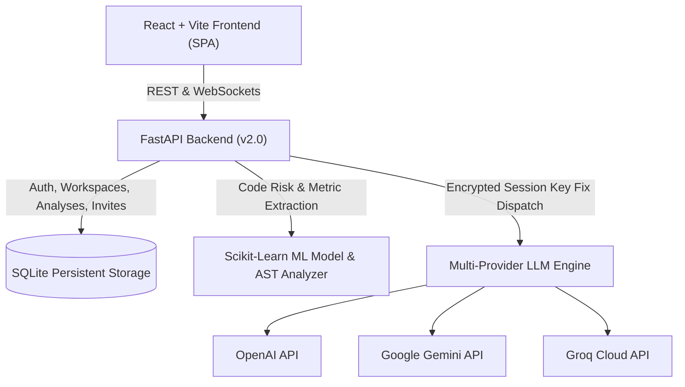

# Enterprise Bug Risk Intelligence & Automated Resolution Platform (v2.0)

[](https://python.org)
[](https://fastapi.tiangolo.com)
[](https://react.dev)
[](https://vitejs.dev)
[](https://docker.com)
[](https://opensource.org/licenses/MIT)

An enterprise-grade machine learning and multi-provider generative AI platform designed to predict source code vulnerability risk, pinpoint cyclomatic anomalies and suspicious lines via AST parsing, and synthesize production-ready code fixes across multiple LLM backends (OpenAI GPT-4o, Google Gemini 1.5/2.0 Flash, and Groq Llama 3).

---

## 🌟 Key Features

- **Predictive Bug Risk Engine**: Pre-trained Random Forest / Ensemble machine learning models compute defect probabilities and cyclomatic complexity metrics across entire repository codebases.
- **AST Suspicious Line Flagging**: Static Abstract Syntax Tree analyzers dissect and highlight risky code blocks, unhandled exceptions, and concurrency deadlocks with Monaco editor syntax previews.
- **Multi-Provider AI Remediation**: User session-isolated LLM engine generating automated code fixes and unified diffs via:
  - **OpenAI** (`gpt-4o`, `gpt-4o-mini`, `gpt-4-turbo`)
  - **Google Gemini** (`gemini-1.5-flash`, `gemini-2.0-flash`, `gemini-1.5-pro`)
  - **Groq Ultra-Fast Inference** (`llama-3.1-8b-instant`, `llama-3.3-70b-versatile`, `mixtral-8x7b-32768`)
- **Strict User & Session Data Isolation**: Zero state bleeding between users. Encrypted per-session API keys and clean history sandboxing.
- **Collaborative Workspaces & RBAC**:
  - **Admin**: Create workspaces, invite teammates, revoke invitations, and manage roles.
  - **Editor**: Execute repository scans, run AI fix generation, and collaborate on shared results.
  - **Viewer**: Read-only access to audit reports, charts, and metrics.
  - **Approval Workflow**: Invited members receive `[ Accept ]` / `[ Reject ]` requests with real-time audit logging.
- **Modern Observability UI**: Dark-mode glassmorphic interface built with Tailwind CSS, Lucide icons, Framer Motion animations, and Recharts risk distribution analytics.

---

## 🏗 Architecture Overview



---

## 🛠 Tech Stack

| Layer | Technology |
|---|---|
| **Frontend** | React 19, TypeScript, Vite 6, Tailwind CSS v4, Lucide React, Framer Motion, Recharts |
| **Backend** | Python 3.11, FastAPI, Uvicorn, Pydantic, WebSockets |
| **Machine Learning** | Scikit-Learn (Random Forest Classifier), Pandas, Joblib, AST parser, Radon metrics |
| **Generative AI** | Google Generative AI (`google-genai` / REST), OpenAI Python SDK, Groq SDK |
| **Database** | SQLite 3 with automatic schema migrations and foreign key constraints |
| **Containerization** | Multi-stage Dockerfile (Node 20 Vite builder + Python 3.11 runner), Docker Compose |

---

## 📋 Prerequisites

- **Python 3.10+** (Python 3.11 recommended)
- **Node.js 18+** and **npm** / **yarn** / **pnpm**
- **Git**
- *(Optional)* **Docker** and **Docker Compose**

---

## 🚀 Local Development Setup

### 1. Clone the Repository
```bash
git clone https://github.com/Ayu-kan/Software_bug_prediction_and_resolver2.0.git
cd Software_bug_prediction_and_resolver2.0
```

### 2. Backend Setup
```bash
# Create and activate virtual environment
python -m venv venv

# Windows:
.\venv\Scripts\Activate.ps1
# Linux/macOS:
source venv/bin/activate

# Install dependencies
pip install -r requirements.txt

# Start FastAPI server
uvicorn backend.main:app --host 0.0.0.0 --port 8000 --reload
```

### 3. Frontend Setup
```bash
# In a separate terminal:
cd frontend
npm install
npm run dev
```
Open **http://localhost:5173** in your browser.

---

## 🐳 Docker Deployment

### Option A: Standalone Unified Production Container
The unified multi-stage `Dockerfile` builds the Vite frontend and serves both the API and static SPA directly from FastAPI on port `8000`:

```bash
# Build the Docker image
docker build -t bugpredict:latest .

# Run container
docker run -d -p 8000:8000 --name bugpredict-app bugpredict:latest
```
Access the application at **http://localhost:8000**.

### Option B: Multi-Container with Docker Compose
Run the modular frontend + backend architecture with Nginx reverse proxy:

```bash
docker-compose up -d --build
```
- Frontend / Nginx: **http://localhost:80**
- Backend API: **http://localhost:8000**

To shut down:
```bash
docker-compose down
```

---

## ☁️ Cloud Deployment Guides

### 1. Render (Web Service)
1. Fork or push this repository to GitHub.
2. Log in to [Render Dashboard](https://dashboard.render.com/) and click **New + -> Web Service**.
3. Select **Docker** environment.
4. Set Environment Variables:
   - `PORT=8000`
   - `ENVIRONMENT=production`
5. Click **Create Web Service**.

### 2. Railway
1. Go to [Railway](https://railway.app/) and create a new project from your GitHub repo.
2. Railway will automatically detect the root `Dockerfile` and deploy the service.
3. Add a persistent volume mounted at `/app` if you wish to persist the SQLite database across container redeploys.

### 3. Google Cloud Run
```bash
# Authenticate and configure project
gcloud auth login
gcloud config set project YOUR_PROJECT_ID

# Build and submit image to Google Artifact Registry
gcloud builds submit --tag gcr.io/YOUR_PROJECT_ID/bugpredict:latest

# Deploy to Cloud Run
gcloud run deploy bugpredict \
  --image gcr.io/YOUR_PROJECT_ID/bugpredict:latest \
  --platform managed \
  --region us-central1 \
  --allow-unauthenticated \
  --port 8000
```

### 4. AWS EC2 / DigitalOcean Droplet
1. Launch an Ubuntu 22.04 LTS instance.
2. Install Docker & Docker Compose:
   ```bash
   sudo apt update && sudo apt install -y docker.io docker-compose
   sudo systemctl enable --now docker
   ```
3. Clone repository and run:
   ```bash
   git clone https://github.com/Ayu-kan/Software_bug_prediction_and_resolver2.0.git
   cd Software_bug_prediction_and_resolver2.0
   docker-compose up -d --build
   ```

---

## ⚙️ Environment Variables Reference

Copy `.env.example` to `.env` to configure your environment:

```env
# Application Environment
ENVIRONMENT=production

# Network & Server Port
PORT=8000
HOST=0.0.0.0

# Database Configuration
DATABASE_PATH=sqlite:///./database.db

# JWT & Authentication Secret Key
SECRET_KEY=generate-a-secure-random-key-for-production-use

# Optional Global AI Provider Fallback Keys
# OPENAI_API_KEY=sk-...
# GEMINI_API_KEY=AIzaSy...
# GROQ_API_KEY=gsk_...
```

---

## 📡 API Endpoints Overview

| Method | Endpoint | Description |
|---|---|---|
| `POST` | `/auth/register` | Register a new user account |
| `POST` | `/auth/login` | Authenticate user & return JWT token |
| `POST` | `/auth/config` | Update user encrypted AI provider keys |
| `GET` | `/auth/config/{user_id}` | Retrieve active provider configuration |
| `POST` | `/workspaces/create` | Create a new collaborative team workspace |
| `GET` | `/workspaces/user/{user_id}` | List user workspaces |
| `POST` | `/workspaces/invite` | Send workspace invitation to registered user |
| `GET` | `/workspaces/invitations/{user_id}` | Get user's incoming pending invitations |
| `POST` | `/workspaces/invitations/{id}/respond` | Accept or reject workspace invitation |
| `DELETE` | `/workspaces/invitations/{id}` | Cancel pending outgoing invitation (Admin) |
| `POST` | `/analysis/run` | Execute ML bug risk & AST file ranking |
| `POST` | `/analysis/resolve` | Generate AI patch solution via configured LLM |
| `POST` | `/analysis/test-connection` | Verify API key connectivity against LLM provider |
| `GET` | `/analysis/history/{user_id}` | Retrieve historical scans for user or workspace |

---

## 🛡️ Security & Privacy Architecture

- **Zero Global Key Bleeding**: API keys are isolated to authenticated user sessions and never shared with team members.
- **Client-Side Masking**: All keys retrieved over REST interfaces are masked (`••••••••`) by default.
- **RBAC Enforcement**: Admin privileges are strictly required to mutate workspace permissions, invite team members, or revoke access.
- **AST Sandboxing**: Source code parsing utilizes static AST analysis without executing untrusted external scripts.

---

## 📄 License

This project is licensed under the MIT License — see the [LICENSE](LICENSE) file for details.
